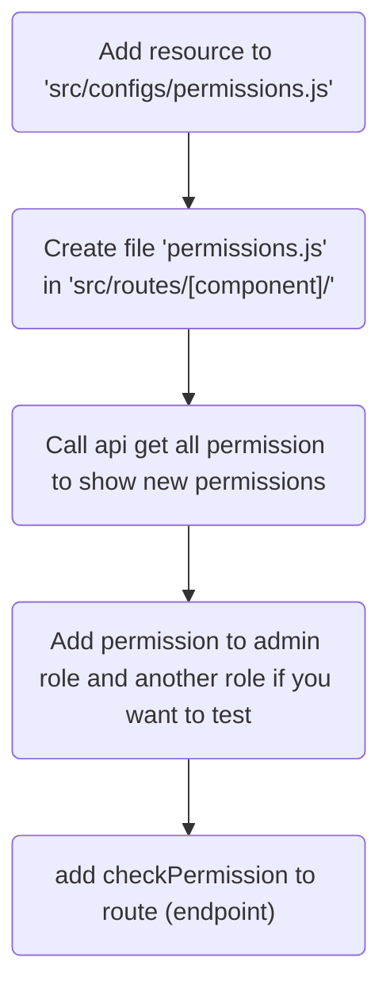

# Project Structure

This project is strured component oriented. Each component contains function files: endpoint.js, controller.js, service.js, model.js, ...

Take a look below diagram:

```
|- env (env files)
|- src (source code)
|   |- www (init www app)
|   |   |- app.js (app)
|   |   |- middleware.js (global middleware)
|   |   |- response-handler.js (cache error and handle response)
|   |   |- router.js (routing loader)
|   |- configs (configurations)
|   |- resources (components)
|   |   |- user (user component - example)
|   |   |   |- service.js (user service)
|   |   |   |- model.js (interact to db)
|   |   |   |- schema-mg.js (define mongoose schema)
|   |   |- ...
|   |- routes (components)
|   |   |- user (user component - example)
|   |   |   |- endpoint.js (routing file)
|   |   |   |- controller.js (handle request & response)
|   |   |   |- schema-api.js (define schema api, using for validation request parameters)
|   |   |- ...
|   |- libs (helper libs)
|   |   |- debug.js (debugger)
|   |   |- ...
```

**Main workflow:**

_(Not recommended any differently workflow)_

```
Client request -> endpoint.js (routing) -> controller.js (handler) -> service.js -> model.js -> schema-mg.js
```

# Coding Rules

## APIs

Implements OpenAPI specification

-   Each resources is represented by plural noun/phrase noun

```
Ex:
/users (not /user)
/messages (not /message)
```

-   Verbs: GET = read, POST = create, PUT = update, DELETE = delete
-   Using parameter when interact a resource, which is specification by id

```
Ex:
POST /users to create user
GET /users/:id to get a user by id
PUT /users/:id to update a user by id
DELETE /users/:id to delete a user by id
...
```

## Another rules

### Prefix function

-   get: using for getting resource

# Diagram

## Config new resource and permission


